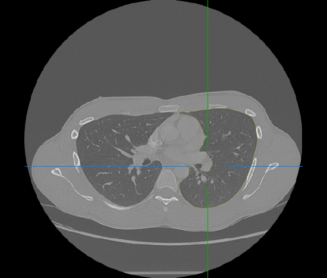
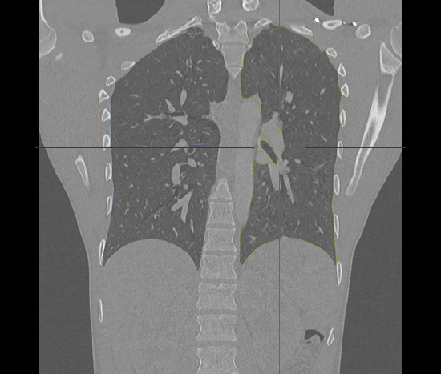
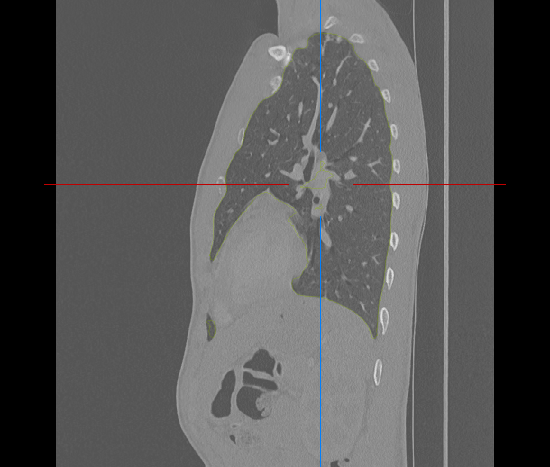
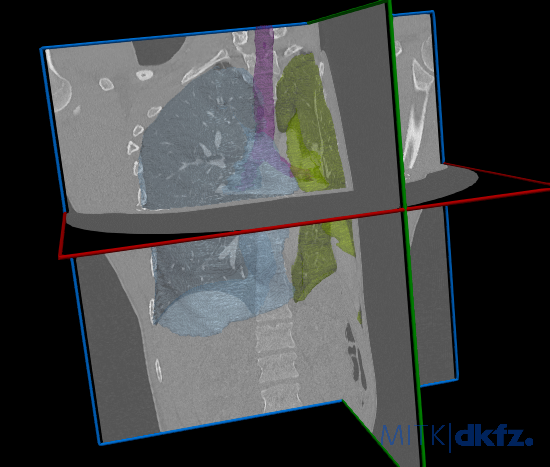

# CT Lung Segmentation Model

Tensorflow+Keras Lung CT Segmentation model trained on `LUNA16`<sup>[1]</sup> dataset using `DeepLabV3+`<sup>[2]</sup> model.

<p align="center">
  &nbsp;&nbsp;
  
  &nbsp;&nbsp;
  
  &nbsp;&nbsp;
  
  &nbsp;&nbsp;
  
  &nbsp;&nbsp;
</p>

Inference example on scan `9994.mha` from `STOIC2021`<sup>[3]</sup> dataset. The input file is expected to be a CT volume of size `512x512x?`. The model predict segmentations for; `Right Lung`, `Left Lung` and `Trachea`. The predicted mask is further post-processed by retaining only the largest connected component of each class.

### Run Model
```
usage: segment_lungs.py [-h] [-i INPUT_FN] [-o OUTPUT_FN] [-m MODEL] [-v]

Lung Segmentation

optional arguments:
  -h, --help            show this help message and exit
  -i INPUT_FN, --input_fn INPUT_FN
                        Input CT Lung Volume
  -o OUTPUT_FN, --output_fn OUTPUT_FN
                        Output Segmentation Mask
  -m MODEL, --model MODEL
                        Trained Model
  -v, --verbose         Verbose Output
```

### Requirements
```
Python 3.7.x
```

### Packages:
```
numpy==1.21.6
tensorflow==2.9.1
scikit-image==0.19.3
SimpleITK==2.1.1.2
```

### References


```
[1] Setio, A.A.A., Traverso, A., de Bel, T., Berens, M.S.N., van den Bogaard, C.,
    Cerello, P., Chen, H., Dou, Q., Fantacci, M.E., Geurts, B., van der Gugten,
    R., Heng, P., Jansen, B., de Kaste, M.M.J., Kotov, V., Lin, J.Y., Manders,
    J.T.M.C., S ́onora-Mengana, A., Garc ́ıa-Naranjo, J.C., Papavasileiou,
    E., Prokop, M.: Validation, comparison, and combination of algorithms for
    automatic detection of pulmonary nodules in computed tomography images:
    The LUNA16 challenge. Medical Image Anal. 42, 1–13 (2017)

[2] Chen, L., Zhu, Y., Papandreou, G., Schroff, F., Adam, H.: Encoder-decoder
    with atrous separable convolution for semantic image segmentation. In:
    ECCV (7). Lecture Notes in Computer Science, vol. 11211, pp. 833–851.
    Springer (2018)

[3] Revel, M.P., Boussouar, S., de Margerie-Mellon, C., Saab, I., Lapotre,
    T., Mompoint, D., Chassagnon, G., Milon, A., Lederlin, M., Bennani, S.,
    Moli`ere, S., Debray, M.P., Bompard, F., Dangeard, S., Hani, C., Ohana, M.,
    Bommart, S., Jalaber, C., El Hajjam, M., Petit, I., Fournier, L., Khalil, A.,
    Brillet, P.Y., Bellin, M.F., Redheuil, A., Rocher, L., Bousson, V., Rousset,
    P., Gr ́egory, J., Deux, J.F., Dion, E., Valeyre, D., Porcher, R., Jilet, L.,
    Abdoul, H.: Study of thoracic ct in covid-19: The stoic project. Radiol-
    ogy 301(1), E361–E370 (2021). https://doi.org/10.1148/radiol.2021210384,
    https://doi.org/10.1148/radiol.2021210384, pMID: 34184935
```
